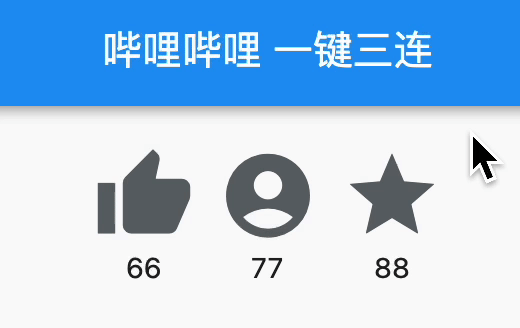

## 0. 效果预览



## 1. 知识拆解

上回说到，我用`Jetpack Compose`写了一个“[一键三连](https://juejin.cn/post/7183941776191782971)”按钮。虽然不是同一时间，但是是同一地点，今天再次挑战用Flutter写一个一键三连，看完的朋友点个赞支持一下，干了兄弟们！

同样的，我们还是分三步走：

1. 布局
2. 交互
3. 动画

### 1.1 布局

我们的布局相对简单，只需要用一个横向的微件包裹三个竖向的微件，而图标与文字在`Column`默认状态下会自动对齐，因此我们可以：

> 本文所示代码均为简化的伪代码，仅为讲解重点，无法直接使用

```dart
Row(children: [
  // 点赞微件
  Column(children: [
    Icon(),
    Text()
  ])
  // 投币微件
  Column(children: [
    Icon(),
    Text()
  ])
  // 收藏微件
  Column(children: [
    Icon(),
    Text()
  ])
])
```

### 1.2 点击事件

要实现点击图标后变红并且数字+1，我们可以用`GestureDetector`微件包裹图标，它提供了`onTap()`点击事件回调, 因此我们可以：

```dart
// 点赞状态，默认没点
bool _thumbed = false;
// 点赞数
int _thumbCounter = 0;

GestureDetector(
	onTap: () => {
    // 点击后状态改为true，点赞数+1，并刷新界面 (有发现这里与Compose的不同点吗? 这里状态是一个基本数据类型，数据改变后，需要手动刷新UI)
		setState(() {
    	_thumbed = true;
      _thumbCounter += 1;
    }
	}),
  child: Column(children: [
    // 点过赞图标为粉色，否则灰色
    Icon(color: _thumbed ? Color(0xfffe669b) : Color(0xff60676a)),
    Text(_thumbCounter.toString())
  ])
}
```

### 1.3 长按动画

Flutter的动画系统与Compose有较大差异，个人感觉不如compose来的方便，它主要分四步来集成：

1. 将`SingleTickerProviderStateMixin`混入`State`类中，用以提供`vsync`对象
2. 初始化一个动画控制器`AnimationController`, 并提供动画所需的合适的插值器`Animatable`(此处使用线性的`Tween`)
3. 用`AnimatedBuilder`包裹目标微件，并将`步骤2`的动画设置给它
4. 播放动画

```dart
 // ...   initState中初始化动画控制器
_controller = AnimationController(duration: const Duration(milliseconds: 1500), vsync: this);
// 动画插值器的起止范围，从0-2π
_animation = Tween<double>(begin: 0, end: 2 * math.pi).animate(_controller)
  
// ...   build()中构建UI
AnimatedBuilder(
	animation: _animation,
  builder: (BuildContext context, Widget? child) {
		return Column( children: [
                  CustomPaint(
                    painter: _ArcPainter(-_animation.value),
										child: Icon(),
                  ),
                  Text(_starCounter.toString())
                ],
           );
  }
)
  
// ... 自定义画笔绘制一键三连的圆弧
class _ArcPainter extends CustomPainter {
  // 圆弧扫过的角度，由外部传入
  double sweepAngle;
	...
  @override
  void paint(Canvas canvas, Size size) {
    // 绘制圆弧，从-π/2为圆弧起始端，结束端为sweepAngle
    canvas.drawArc(
        -math.pi / 2,
        sweepAngle
    );
  }
}

// ... 在前面的GestureDetector中增加触摸事件
GestureDetector(
	onLongPressStart: (LongPressStartDetails detail) => {
    // 长按开始时播放动画, 圆弧慢慢变长
    _controller.forward()
  }
  onLongPressUp: () => {
    // 长按结束时反向播放动画，表现为圆弧慢慢缩短
    _controller.reverse()
  }
}
```

## 2. 总结

通过以上的例子，我们可以发现：

1. Flutter采用类的方式来组织UI代码，状态被包含在其所属的`State`子类中, 类似于`React`中的`类组件`
2. 而Compose采用函数的方式来组织UI代码，状态直接属于函数内部，类似于`React`中的`函数组件`
3. 仅就此案例来说，同样为声明式UI，Flutter代码对比Compose代码稍显啰嗦，对动画的集成也需要更多的步骤来完成
4. 但其中的编程思想是类似的：UI由各个组件相互包裹嵌套来描述，并在底层转化为DOM树，UI的变化依赖于状态，状态改变UI随之改变，并在变化时由系统自动计算其Diff以减少重复渲染的成本

